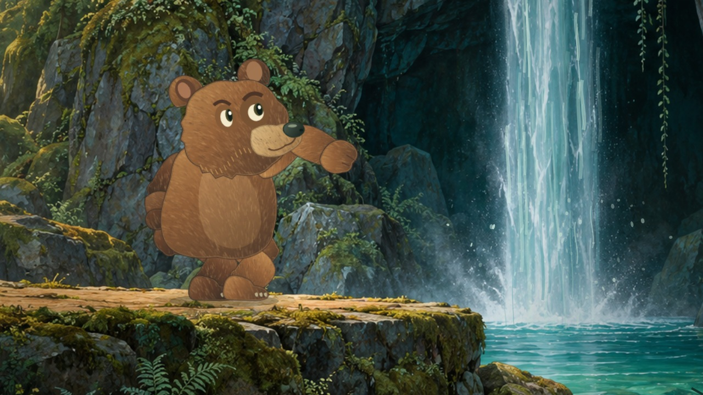

# Brookframe

**A small, open-source harness for making editable 2D short films with code.**

Brookframe joins character performance, shot timing, painted backgrounds, procedural effects, audio and deterministic rendering in one portable project. It is designed for an AI coding agent or a human animator to inspect a frame, change a performance, and render the same scene again.

The included film, **The Other Side**, is a 10-second, 1080p animated short: a bear approaches a forest waterfall, tests the spray, recoils from a cold droplet, gathers courage, and walks through the curtain of water.



## Quick start

Requires **Node.js 20+** and **FFmpeg** on PATH.

```sh
npm install
npm run preview
# Open http://localhost:8080
npm run render
# output/the-other-side.mp4
```

The included soundtrack is ready to use. Python is only needed if you want to regenerate it.

## What is implemented

- A real Canvas 2D scene renderer shared between browser preview and headless output.
- An editable shot manifest with numeric keyframe tracks and named story beats.
- A reusable core: easing, deterministic randomness, two-bone inverse kinematics, shot selection and validation.
- A vector bear rig with individually articulated limbs, planted-foot walk cycles, layered fur, brows, pupils, eyelids, muzzle, head tilt, recoil, reach, duck and wetness.
- Absolute-time water ribbons, spray, ripples, contact splashes, suspended motes and foreground plant motion.
- World-space waterfall occlusion so different body parts disappear as they enter the water.
- A browser studio with playback, scrubbing, frame stepping, audio, rig bounds, track editing and JSON export.
- CLI frame exports, a contact sheet, 1080p H.264/AAC rendering, and a machine-readable render report.
- Original synthesized stereo music, water and Foley, plus a script for rebuilding the mix.
- Tests for time sampling, IK, validation and pixel-identical arbitrary-time seeking.
- A GitHub Actions workflow that tests and renders the sample film.

This is a working **v0.1**, not a complete drawing application. The included rig and art direction are authored in JavaScript. There is no text-to-film model, automatic character generation, universal rig importer, lip-sync engine or Synfig/OpenToonz integration. The preview's character inspector is tailored to the sample track schema.

## Agent workflow

1. Read `film.json` to understand the shots and story beats.
2. Change performance tracks, character geometry or scene layers.
3. Render selected frames and the contact sheet.
4. Inspect the images for silhouette, eye direction, contact, occlusion and continuity.
5. Run the tests and render the final MP4.

```sh
node src/cli.mjs validate
node src/cli.mjs frame --time 4.34 --output output/recoil.png
node src/cli.mjs contact
node src/cli.mjs render --width 1280 --output output/draft.mp4
node src/cli.mjs render
npm test
```

All timestamps are in seconds. The film has 240 frames sampled at `frame / 24`. The MP4 duration is exactly 10 seconds. Rendering does not require a browser, network connection, API key, GPU, or external model service.

## Start another film

```sh
node src/cli.mjs init my-film
node src/cli.mjs preview --film films/my-film/film.json
node src/cli.mjs render --film films/my-film/film.json --output output/my-film.mp4
```

`init` copies the complete working sample into a new film directory. Replace its background, revise `bear.mjs` or introduce your own rig, then edit `scene.mjs` and `film.json`. Existing directories are never overwritten.

A scene exports `createScene(film, assets)` and returns an object with `render(context, time, options)`. The supplied context is compatible with browser Canvas 2D and `@napi-rs/canvas`. `assets.background` contains the loaded manifest background.

```js
import {track} from '../../src/core.mjs';
export function createScene(film, assets) {
  return {
    render(ctx, time) {
      ctx.drawImage(assets.background, 0, 0, ctx.canvas.width, ctx.canvas.height);
      const x = track([[0, 100], [4, 600, 'smooth']], time);
      // Draw your character at x using time-sampled pose data.
    }
  };
}
```

A numeric track is an ordered array of `[time, value, easing]`. Easing belongs to the destination keyframe. Values hold before the first and after the last keyframe. Available easing names: `linear`, `smooth`, `smoother`, `in`, `out`.

## Layout

```text
src/core.mjs                   reusable math, drawing and timeline primitives
src/cli.mjs                    renderer, frame inspector and preview server
web/index.html                 timeline studio
films/bear-waterfall/film.json  shots, keyframes and story beats
films/bear-waterfall/bear.mjs   editable vector character rig
films/bear-waterfall/scene.mjs  cinematography, staging and effects
films/bear-waterfall/assets/    painted background
films/bear-waterfall/soundtrack.wav
scripts/soundtrack.py           original score and Foley synthesis
tests/                         math and render determinism tests
```

## Soundtrack

```sh
python3 -m pip install numpy scipy
python3 scripts/soundtrack.py
```

The script creates a 48 kHz stereo WAV using a fixed seed: a pentatonic bell/marimba phrase, warm harmonic bed, layered waterfall noise, water burbles, distance-driven footsteps, breathing, a cold plip, and entry splashes. No downloaded music or sound recordings are used. The score is original synthesized audio, not recorded live Foley. For a different film, supply a matching `soundtrack.wav` next to its manifest. The renderer also works without audio.

## Artwork and licensing

The source is MIT licensed. The included background was generated with OpenAI image generation for this production; its prompt and provenance are in `docs/art-direction.md`. The bear, animated effects and sound were created in code. The background is a static painting; the film animates the character and foreground effects over it. The preview contains no remote dependencies or telemetry.

See `docs/architecture.md` for implementation details and current limits.
